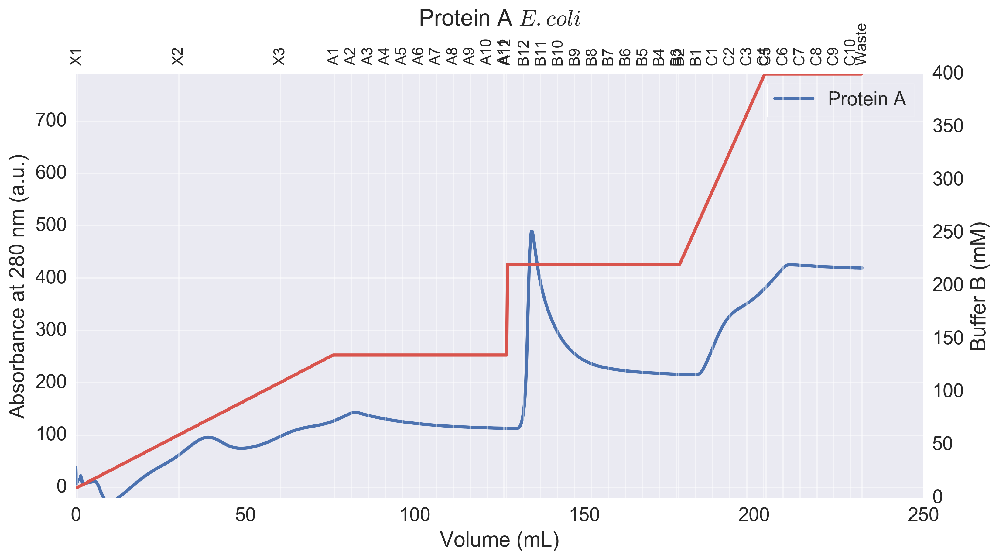

# FPLCplot

`FPLCplot` is Python based tool for plotting high quality presentable chromatograms, with data outputted from the GE Life Sciences / Amersham Biosciences UNICORN 5.X software (for AKTA FPLC systems). This tool is accessible through an interactive Jupyter notebook (using iPython widgets for interactivity) or through a TKinter GUI interface.

The main advantages of this tool are:
* Generating a plot with gridlines which correspond to the fractions, rather than regular divisions of the x-axis.
* Plotting actual molar concentrations on the secondary y-axis, in place of the percentage of buffer B.

#### Dependencies
- Python 2.7
- Matplotlib
- Seaborn
- NumPy
- ipywidgets
- Pandas

## Usage
`FPLCPlot` takes an Excel `.XLS` file outputted from the UNICORN software as an input, which it parses to extract the relevant curves for plotting. Due to the arrangement of the curve data in the Excel file, the Excel file must be outputted from UNICORN with all curves selected (despite only UV absorbance, fractions, and % conductivity curves currently only supported by `FPLCPlot`).

### FPLCPlot via Jupyter notebook
To launch the interactive Jupyter notebook interface, clone this repository locally, and then run the command `jupyter notebook` from a terminal when in the same directory.

### FPLCPlot TKinter GUI
To launch the TKinter GUI interface to FPLCPlot, first simply clone the repository locally. Then double click the `FPLCPlot.pyw` file from your file explorer, which should automatically launch the GUI.

---

## Features
### Multiple overlay plots
Using the Jupyter notebook interface to `FPLCplot`, UV absorbance traces from multiple Excel files can be plotted on the same figure.

### Gridlines determined by fractions
Gridlines on the x-axis are divided according to the fractions from the FPLC machine.

### Buffer B concentration on second y-axis
Buffer B concentration may be plotted on a secondary y-axis, as a percentage and absolute concentration in molarity. The first file alphabetically in the file list is chosen as the file for the buffer B trace, when plotting multiple traces on one figure.
